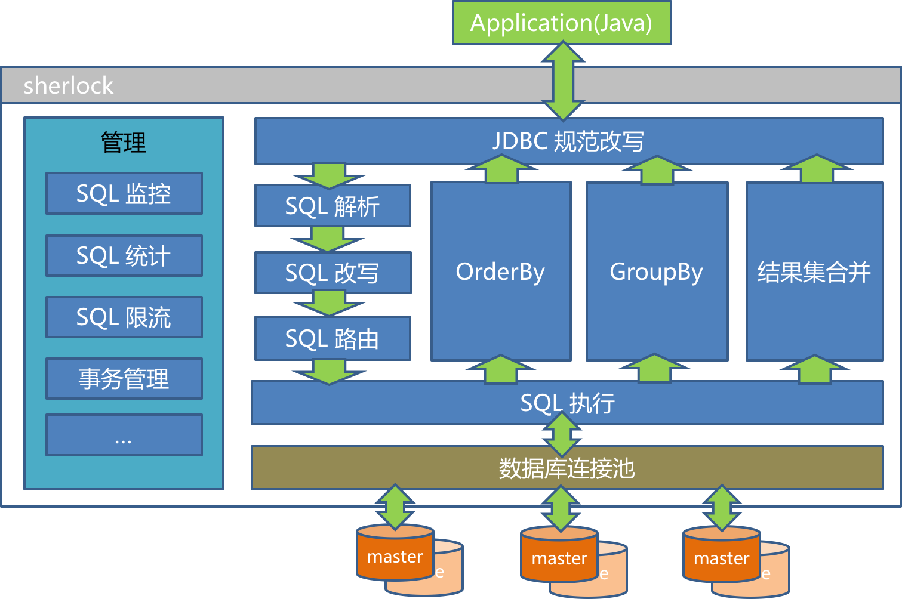

# sherlock
#### ( Distributed Data Layer )

提供基于JDBC规范的客户端分库、分表数据路由方案

## 支持范围
* JDK6+
* PostgreSQL
* MySQL
* Oracle
* 所有持久层框架

## 功能简介

* 多租户
* 读写分离
* 读负载均衡
	* 轮询策略
	* 权重策略
* 全局序列号
* 全局表复制
* 多租户
* 垂直划分表
* 逻辑表ER关系
* 分库
* 分表
* 数据聚合
* 结果集归并 
* 路由规则缓存（开发中）
* SQL限流（开发中）
* SQL监控（开发中）
* 分布式事务（见galaxy）
* 支持的数据库（PostgreSQL、Oracle和MySQL）

## 架构图


## 示例代码

* 配置定义
	* 定义分片数据源
	* 定义全局表
	* 定义逻辑表和逻辑子表
	* 定义分库和分表路由规则

```xml
<sherlock:data-source id="shardingDataSource" database-type="PostgreSQL" >
	<sherlock:data-source-partitions>
		<sherlock:data-source-partition name="p0" read-strategy="weight">
			<sherlock:master-data-source ref="ds0" weight="200" />
			<sherlock:slave-data-source ref="ds0" weight="200" />
			<sherlock:slave-data-source ref="ds0" weight="400" />
		</sherlock:data-source-partition>
		<sherlock:data-source-partition name="p1">
			<sherlock:master-data-source ref="ds1" />
		</sherlock:data-source-partition>
		<sherlock:data-source-partition name="p2">
			<sherlock:master-data-source ref="ds2" />
		</sherlock:data-source-partition>
	</sherlock:data-source-partitions>
	<sherlock:tables>
		<sherlock:global-table name="stock"/>
		<sherlock:logic-table name="t_order" primary-key="order_id" table-postfixes="_0,_1,_2" database-strategy="orderDatabaseStrategy" table-strategy="orderTableStrategy">
			<sherlock:logic-child-table name="t_item" primary-key="item_id" foreign-key="order_id">
				<sherlock:logic-child-table name="t_item_ext" primary-key="ext_id" foreign-key="item_id"/>
			</sherlock:logic-child-table>
		</sherlock:logic-table>
	</sherlock:tables>
</sherlock:data-source>

<sherlock:strategy id="orderDatabaseStrategy" sharding-columns="user_id" expression="p${user_id.intValue() % 3}"/>

<sherlock:strategy id="orderTableStrategy" sharding-columns="order_id" expression="_${order_id.intValue() % 3}"/>

```